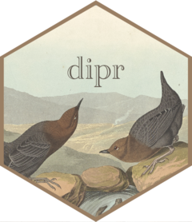

<!-- README.md is generated from README.Rmd. Please edit that file -->

```{r, include = FALSE}
knitr::opts_chunk$set(
  collapse = TRUE,
  comment = "#>",
  fig.path = "man/figures/README-",
  out.width = "100%"
)
```

```{r make-sticker, include=FALSE}
if (!file.exists("man/figures/logo.png") && 
    !identical(Sys.getenv("USERDOMAIN"), "POPDATA")) {
  source("inst/sticker/sticker.R")
}
```

# dipr  <!--  --> 

<!-- badges: start -->
<!-- [](https://opensource.org/licenses/Apache-2.0) -->
<!-- [](https://github.com/bcgov/dipr) -->
<!-- [](https://github.com/bcgov/repomountie/blob/master/doc/lifecycle-badges.md) -->
<!-- badges: end -->


The `dipr` package is an R package that loads and provides means of caching of `.dat.gz` files. Functions are also provided to convert from `.dat.gz` files to Apache Arrow formats.

## Installation
While this package is intended for us within the SRE you can install the package from GitHub:

```{r, eval=FALSE}
if(!requireNamespace("remotes")) install.packages("remotes")
remotes::install_github("bcgov/dipr")
```


## Installation inside the SRE
Installation of `dipr` is slightly different than typical R package installation. To begin with you will need to clone the dipr repo. To do this you need access to the SRE instance of GitLab. 

Go to this website: https://projectsc.popdata.bc.ca/

Scroll down and click on "Sign in with Pop Data Sso"

You will need to do this step everytime you log into the SRE.

Next go to this site: https://projectsc.popdata.bc.ca/profile/personal_access_tokens

Create a new Personal Access Token enabling each scope and typing in your username. This should create a new personal access token. Those are your "git credentials". Save those on your "U" drive along with your user name. 

### Install from R

```{r eval=FALSE}
## First you need to store your credentials created in the step above. This is a one time only thing
token <- credentials::git_credential_ask("https://projectsc.popdata.bc.ca")$password

## These next two lines download the package to a temporary folder and install it. 
resp <- httr::GET("https://projectsc.popdata.bc.ca/api/v4/projects/90/repository/archive.tar.gz",
                  query = list(sha = "v1.2.1"),
                  httr::write_disk(tempfile(fileext = ".tar.gz")),
                  config = httr::add_headers(`Private-token` = token))
remotes::install_local(resp[["content"]])
```


## Usage
The `dipr` package comes with some sample _fake_ data to illustrate the usage of the package and facilitate unit tests. Specifically, the package provides a fake data dictionary and a compressed data file. Example fake data can be seen like this:
```{r}
library(dipr)
dipr_examples()
```

Individual paths can be extracted like this:
```{r}
data_dict_path <- dipr_example("starwars-dict.txt")
dict <- read.table(data_dict_path)
dict
dat_path <- dipr_example("starwars-fwf.dat.gz")
```

The main function in the package is `read_dat()` which allows you to directly read `.dat.gz files:
```{r}
raw <- read_dat(data_path = dat_path,
                data_dict = dict)
head(raw)
```

If two files share a common data dictionary you can supply a vector of filenames to the `data_path` argument and `read_dat` will combine them for you into one dataframe:

```{r}
dat_path2 <- dipr_example("starwars-fwf2.dat.gz")
raw_two_files <- read_dat(
    data_path = c(dat_path, dat_path2),
    data_dict = dict,
    id = "file"
  )
```

Working with the data.table package for data manipulation is also possible in dipr using the `read_dat_dt` function:
```{r}
raw_dt <- read_dat_dt(
    data_path = dat_path,
    data_dict = dict
  )
```


### Data Dictionary
Data Dictionaries need to be in a data frame format that includes 'name`, 'start', 'stop', and 'length' columns (in any order):

```r
> dict
# A tibble: 64 x 4
   start  stop length name                      
   <dbl> <dbl>  <dbl> <chr>   
```


## Project Status
Under development

## License


    Copyright 2019 Province of British Columbia

    Licensed under the Apache License, Version 2.0 (the "License");
    you may not use this file except in compliance with the License.
    You may obtain a copy of the License at 

       http://www.apache.org/licenses/LICENSE-2.0

    Unless required by applicable law or agreed to in writing, software
    distributed under the License is distributed on an "AS IS" BASIS,
    WITHOUT WARRANTIES OR CONDITIONS OF ANY KIND, either express or implied.
    See the License for the specific language governing permissions and
    limitations under the License.
   
